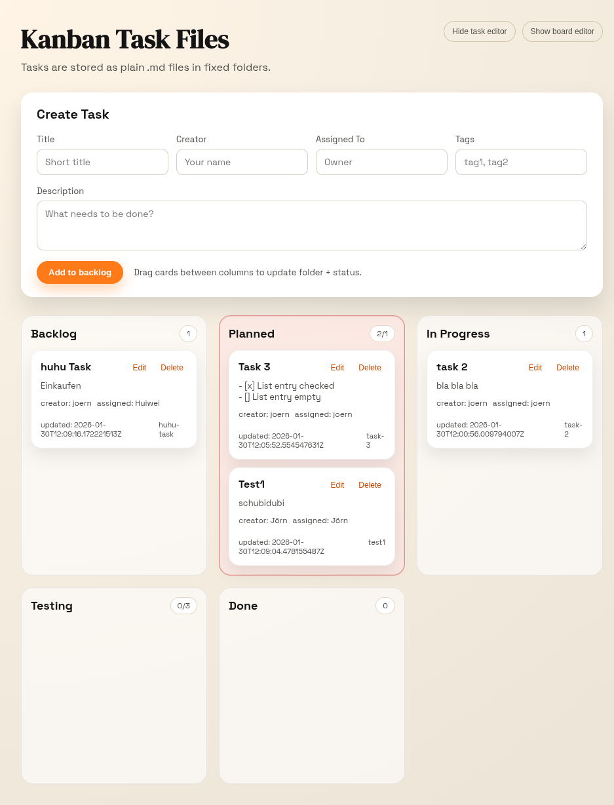

# Kanban Task Files

A minimal Kanban board where every task is a plain `.md` file stored in folders defined by a `.workspace-kanban` config. The UI is a static web app served by a small compiled Rust backend.



## Use Cases

- Small team, no database: run against a shared folder; tasks are plain `.md` files with minimal setup.
- Network share (SMB/NFS): point `--target` at a shared directory so all users see updates.
- Git-based workflow: keep `.workspace-kanban`, `.kanban-theme.conf`, and tasks in a repo for change history.
- Dashboard mode: hide the task editor and display the board on a shared screen.
- Containerized central instance: run in Docker with a mounted volume and serve the UI to the team.

## Features

- Board structure defined by `.workspace-kanban` (custom columns)
- Tasks are simple `.md` files with a predictable header + body
- Drag-and-drop between columns updates folder + status
- WIP limits per column with visual alarm + count/limit badge
- Editor visibility persists in the browser
- Minimal dependencies; compiled backend

## Quick Start

```bash
# from repo root
cargo run --release --manifest-path server/Cargo.toml
```

Open: `http://localhost:8787`

### Environment Variables

- `KANBAN_ROOT` (default: `./kanban_data`) — folder where task files live
- `KANBAN_PORT` (default: `8787`) — server port

Example:
```bash
KANBAN_ROOT=/path/to/tasks KANBAN_PORT=9000 cargo run --release --manifest-path server/Cargo.toml
```

### CLI Flags

- `-t`, `--target <dir>` — base directory for task folders (overrides `KANBAN_ROOT`)
- `-y`, `--yes` — create missing folders without prompting
- `-h`, `--help` — show help
- `--show-task-editor=<bool>` — default visibility for task editor (true/false)
- `--show-board-editor=<bool>` — default visibility for board editor (true/false)
- `--write-default-theme` — create `.kanban-theme.conf` with default values
- `--open-browser=<bool>` — open the system default browser on start
- `--open-browser-once=<bool>` — open browser only once per target (default: true)

Example:
```bash
cargo run --release --manifest-path server/Cargo.toml -- --target ./kanban_data --yes --show-task-editor=true --show-board-editor=false
```

Help output (excerpt):
```text
Kanban Task Files server

Usage:
  kanban-server [options]

Options:
  -t, --target <dir>             Base directory for task folders (default: ./kanban_data or KANBAN_ROOT)
  -y, --yes                      Create missing folders without prompting
  -h, --help                     Show this help message
      --show-task-editor=<bool>  Show task editor on load (default: true)
      --show-board-editor=<bool> Show board editor on load (default: false)
      --write-default-theme      Create .kanban-theme.conf with default values
      --open-browser=<bool>      Open default system browser on start (default: false)
      --open-browser-once=<bool> Open browser only once per target (default: true)

Note (Linux): `--open-browser` uses `xdg-open`, so it must be available in your PATH.
```

## Build Instructions

Build the release binary:
```bash
cargo build --release --manifest-path server/Cargo.toml
```

Run the binary directly:
```bash
./server/target/release/kanban-server
```

## Board Configuration (`.workspace-kanban`)

The board structure is defined by a file named `.workspace-kanban` inside the target directory.
Each line defines a folder ID and an optional display title:

```text
backlog: Backlog
planned: Planned
in_progress: In Progress
done: Done
```

You can add a WIP limit per column (0 disables the alarm):

```text
in_progress: In Progress wip=3
```

Rules:
- Folder IDs become directory names and must be `a-z`, `0-9`, `_` or `-`
- Blank lines or `#` comments are ignored
- If the file is missing, the server asks to create a default one (or uses `-y`)

If the config removes a folder that still has tasks, the server will prompt you to either:
- delete the tasks,
- move them to another folder,
- or abort.

## Theme Configuration (`.kanban-theme.conf`)

Optional theme settings live in the target directory in `.kanban-theme.conf`.
Use simple `key=value` pairs:

```text
headline=My Team Board
color.accent=#ff7a18
color.accent_deep=#c24800
color.ink=#141414
color.muted=#4e4c48
color.card=#ffffff
color.bg_start=#fff4e6
color.bg_mid=#f7efe2
color.bg_end=#ece4d7
```

Notes:
- The file is optional; if missing, defaults are used.
- Generate a starter file with `--write-default-theme`.
- Colors map to CSS variables (snake or hyphen style, e.g. `bg_start` → `--bg-start`).
- `headline` updates the page title and the main header.

## Task File Format

Each task is stored as `id-slug-from-title.md` inside one of the folders.

Example:
```text
creator: Alice
assigned_to: Bob
created_at: 2026-01-30T12:00:00Z
updated_at: 2026-01-30T12:00:00Z
status: backlog
tags: ui, backend
title: Draft onboarding flow

Write a short description here.
```

## Concurrency Warning

There is no locking or conflict detection. If multiple people edit the same task at the same time, the last save wins and can overwrite other changes.

## API

All endpoints use JSON.

- `GET /api/tasks` → list tasks grouped by folder (includes board config)
- `POST /api/tasks` → create task
- `PUT /api/tasks/:id` → update task content
- `POST /api/tasks/:id/move` → move task to folder
- `DELETE /api/tasks/:id` → delete task
- `GET /api/board` → get board config
- `PUT /api/board` → update board config
- `GET /api/ui` → get UI defaults
- `GET /api/theme` → get theme settings

Task schema:
```json
{
  "id": "draft-onboarding-flow",
  "title": "Draft onboarding flow",
  "description": "Write a short description here.",
  "creator": "Alice",
  "assigned_to": "Bob",
  "created_at": "2026-01-30T12:00:00Z",
  "updated_at": "2026-01-30T12:00:00Z",
  "status": "backlog",
  "tags": ["ui", "backend"],
  "folder": "backlog"
}
```

## Board Editor (Frontend)

The UI includes a Board Editor section that lets you update columns directly from the browser.
Saving writes the `.workspace-kanban` file via `PUT /api/board`, and the board updates on the next refresh.
The WIP limit can be edited in the Board Editor; if the number of tasks exceeds the limit, the column is highlighted.

## Editor Visibility

The UI remembers editor visibility (task/board) using `localStorage`. If no preference is saved yet, the defaults from the server (CLI flags) are used.

## Project Layout

- `server/` — Rust backend (compiled)
- `web/` — static frontend assets
- `kanban_data/` — default task storage root
- `docs/` — screenshots

## Maintenance

This README is intended to be kept in sync with the app behavior. If features or APIs change, update this file and the screenshot.
